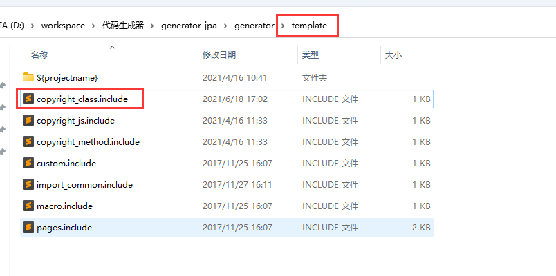
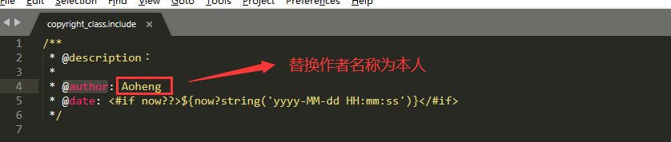
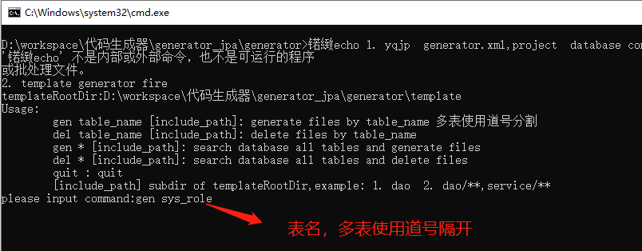

# JPA代码生成器使用指南

**原理**

1. .Java .html .css .js本质上都是文本文件，可以通过freemarker模板文件。生成对应的.Java .html .css .js文件。
2. 通过数据库连接，获取数据库表的元数据，例如：表的字段名称，中文注释等，依次生成对应的增删改查功能。

**使用**

**修改配置文件****generator.xml**

1. 代码生成器数据库连接
2. 微服务名以及包路径
3. 网关映射名
4. 微服务数据库连接

**修改@author**

敲重点：路径：generator_jpa\generator\template下

copyright_class.include文件中@author替换为作者为本人名称

**操作说明**

通过windos窗口打开文件夹,点击打开angogo-gen.bat，

运行angogo-gen.bat用于再输入gen 表名,例如:gen sys_user 用于生成代码 

主要配置文件为generator.xml,里面可以修改数据库连接,以及java包名文件路径名称 

执行代码生成命令(例如: gen sys_user ,xxxxx)后,生成的代码对应拷贝如下: 

生成的.sql文件是菜单添加的sql,一般根据业务修改后在数据库执行. 

